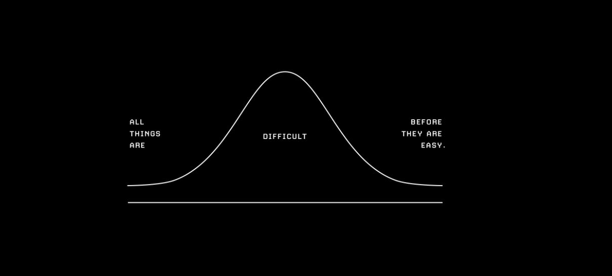

<!--  -->

<h1 align="center">Hi 👋, I'm Akshay Jadhav</h1>
<h3 align="center">Coding</h3>

- 🌱 I’m currently learning **Full Stack Web development MERN stack**

- 📝 I regularly write articles on [Hashnode](https://apj-cr.hashnode.dev/)

- 📫 How to reach me **akshayjadhav2133@gmail.com**

- [Portfolio Website](https://akshayjadhavapjcr.netlify.app/)

# Projects

## React JS

1. Netflix Clone

   1. [Live Demo](https://netflixcloneapjcr.netlify.app/)
   2. [Repository](https://github.com/apj19/Netflix-Clone)

2. Comfy E-commerce

   1. [Live Demo](https://comfyapjcr.netlify.app/)
   2. [Repository](https://github.com/apj19/comfy)

3. Pokedex

   1. [Live Demo](https://pokedexapjcr.netlify.app/)
   2. [Repository](https://github.com/apj19/pkemon)

4. Restaurant

   1. [Live Demo](https://mealsapjcr.netlify.app/)
   2. [Repository](https://github.com/apj19/Restaurant)

5. TODO

   1. [Live Demo](https://taskapjcr.netlify.app/)
   2. [Repository](https://github.com/apj19/ToDo)

6. Redux TODO

   1. [Live Demo](https://reduxtodoapjcr.netlify.app/)
   2. [Repository](https://github.com/apj19/ReducTodo)

7. Art

   1. [Live Demo](https://artapjcr.netlify.app/)
   2. [Repository](https://github.com/apj19/GemotricArt)

8. Rock-Paper-Scissors
   1. [Live Demo](https://rpslsapjcr.netlify.app/)
   2. [Repository](https://github.com/apj19/Rock-Paper-Scissors)

## JavaScript

1. Weather App

   1. [Live Demo](https://weatherappapjcr.netlify.app/)
   2. [Repository](https://github.com/apj19/Dom-Manipulation/tree/main/Weather-App)

2. Countries Data visualization Mega Project

   1. [Live Demo](https://countriesdataapjcr.netlify.app/)
   2. [Repository](https://github.com/apj19/Dom-Manipulation/tree/main/Dom%20Mega%20Project)

3. LeaderBoard

   1. [Live Demo](https://leaderboardapjcr.netlify.app/)
   2. [Repository](https://github.com/apj19/Dom-Manipulation/tree/main/leadboard)

4. Countries Search

   1. [Live Demo](https://searchcountryapjcr.netlify.app/)
   2. [Repository](https://github.com/apj19/Dom-Manipulation/tree/main/Countries-Search)

5. Countries Population visualization

   1. [Live Demo](https://worldcountriesdataapjcr.netlify.app/)
   2. [Repository](https://github.com/apj19/Dom-Manipulation/tree/main/World_Countries_Data)

6. Weight of object on planets

   1. [Live Demo](https://weightonplanet.netlify.app/)
   2. [Repository](https://github.com/apj19/Dom-Manipulation/tree/main/weight-on-plantes)

7. Click on Page
   1. [Live Demo](https://clickonpage.netlify.app/)
   2. [Repository](https://github.com/apj19/Dom-Manipulation/tree/main/ClickOnPage)

## HTML CSS Talwind CSS

1. UI Design Mega Project:- built responsive website design using HTML,CSS and Tailwind CSS. Added Darkmode with the help of JS.

   1. [Live Demo](https://ui-design-project-apjcr.netlify.app/)
   2. [Repository](https://github.com/apj19/FrontendMentorChallenges)

2. Brand Logos:- built differnt logos using css

   1. [Live Demo](https://css-logos.netlify.app/)
   2. [Repository](https://github.com/apj19/Logos)

3. Visual Studio Code website Clone using Tailwind CSS
   1. [Live Demo](https://chic-hamster-37df2a.netlify.app/)
   2. [Repository](https://github.com/apj19/VS-Code-Clone)

## Languages and Tools

 

 

 

## Other Technologies

### basic understanding of -

     

 
 

